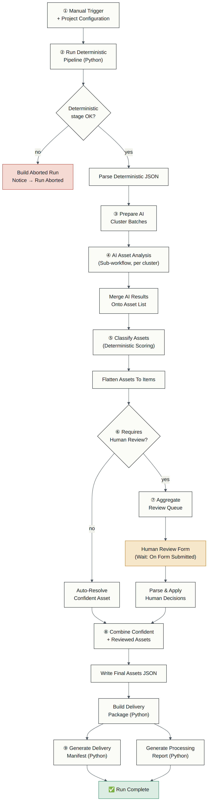
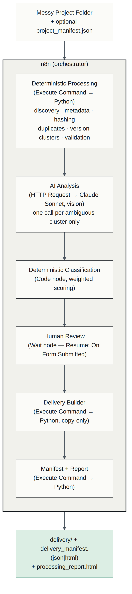
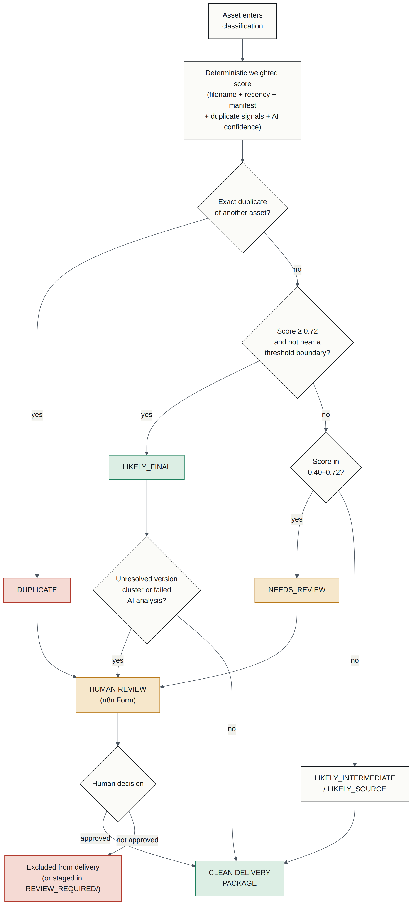

# Creative Asset Handoff Intelligence

**Turning messy creative project folders into clean, validated, delivery-ready asset packages.**

A production-oriented **n8n workflow** for automating the operational
cleanup and validation that happens after a creative campaign wraps —
built to demonstrate when to use deterministic automation, when to use AI
reasoning, and when to stop and ask a human.

This is one of five small AI automation workflows in a creative-agency
automation portfolio. The other four (Client Creative Intelligence, Shoot
Intelligence, Video Intelligence, Client Feedback Intelligence) lean on
AI-heavy reasoning pipelines; this one exists specifically to prove a
different, arguably harder skill: **decomposing a real business workflow
into the right mix of deterministic logic, AI-assisted judgment, branching,
file operations, and human review — and shipping it as an actual,
importable n8n workflow**, not a diagram of one.

> This is **not** an "AI-powered DAM." It does **not** claim fully
> autonomous delivery, and it does **not** claim perfect final-file
> detection. It scores its own confidence and routes anything uncertain to
> a human, who keeps final authority over every delivery decision.

---

## The agency problem

Every finished campaign leaves behind a folder like this:

```
final.png
final_v2.png
final_FINAL.png
final_final_revised.png      ← exact duplicate of final_FINAL.png
instagram_post_1080.png
post_1080_final.png          ← exact duplicate of instagram_post_1080.png
post_1080_v2.png
promo_square_wrong_size.png  ← 800×800, spec calls for 1080×1080
reel_final.mp4
reel_final_2.mp4
reel_v1_draft.mp4            ← 720×1280, spec calls for 1080×1920
logo.svg / logo_new.svg / logo_latest_final.svg
source/campaign_master.psd
```

Multiple versions, silent duplicates under different names, files that
*look* final but aren't, wrong dimensions, source files mixed in with
deliverables. A human eventually has to open every file and sort it out.
That's tedious, repetitive, and exactly the shape of problem worth
automating the mechanical 80% of while keeping a human in the loop for the
ambiguous 20%.

## Why it matters

The interesting engineering problem here isn't "call an LLM on some
files" — it's knowing **which parts shouldn't touch an LLM at all**.
File extension validation, image dimensions, file hashing — all measurable,
all deterministic. Whether `final_v2.png` and `final_FINAL.png` are really
versions of the same creative, or whether an ambiguously-named asset should
be treated as final — that's a judgment call worth a model's opinion, with
a human still holding the pen.

## How the workflow works

```
MESSY PROJECT FOLDER
        ↓
DISCOVER  →  INSPECT  →  CLASSIFY  →  VALIDATE
        ↓
DUPLICATE / VERSION ANALYSIS   (deterministic: hashing + perceptual hashing + filename clustering)
        ↓
AI REVIEW                      (Claude Sonnet, vision — ambiguous clusters only)
        ↓
HUMAN APPROVAL                 (n8n Form — mandatory for anything uncertain)
        ↓
CLEAN DELIVERY PACKAGE  +  MANIFEST + REPORT
```

Full node-by-node breakdown: [`docs/workflow.md`](docs/workflow.md).
Architecture rationale: [`docs/architecture-decision.md`](docs/architecture-decision.md).

### Workflow diagram



*(Mermaid source: [`docs/diagrams/workflow.mmd`](docs/diagrams/workflow.mmd) — also renders natively on GitHub.)*

### Architecture diagram



### Decision-flow diagram



---

## What's deterministic, what's AI, and why

| Deterministic (measured, not guessed) | AI-assisted (judgment call, always reviewed) |
|---|---|
| File extension / MIME / format validity | Whether `final.png` / `final_v2.png` / `final_FINAL.png` are really the same creative's versions |
| Image dimensions, video duration/codec | Which member of an ambiguous cluster looks delivery-ready |
| Exact duplicate detection (SHA-256) | The general creative type (post / logo / reel cover / banner) |
| Near-duplicate detection (perceptual hash) | Whether two visually-similar files actually differ meaningfully |
| Manifest deliverable matching | — |
| **Final classification score** (weighted rule-based function; AI confidence is *one* input, never the decision) | |

AI is called **once per ambiguous version cluster**, never per file, and
only after deterministic clustering has already done the cheap, exact
grouping work. Clusters that reduce to a single unique file hash (pure
duplicate sets) never reach the AI step at all. Full reasoning:
[`docs/deterministic-vs-ai.md`](docs/deterministic-vs-ai.md).

---

## Tools used

| Layer | Technology | Purpose |
|---|---|---|
| Workflow orchestration | **n8n** (self-hosted) | Sequencing, branching, human-in-the-loop, calling Python & the AI model |
| File processing | **Python / Pillow / ffprobe** | Discovery, metadata, safe decode-and-verify |
| Duplicate / similarity detection | **SHA-256 + imagehash (pHash)** | Exact and near-duplicate detection |
| Multimodal AI | **Claude Sonnet (vision)**, plain HTTP Request | Version/finality reasoning for ambiguous clusters only |
| Structured-output validation | **jsonschema** (Python) + hand-rolled JS validator (n8n) | Never trusts raw model text |
| Human review | **n8n Wait node** (Resume: On Form Submitted) | Native human-in-the-loop, no external server |
| Reporting | Plain HTML/CSS (Python templates) | `delivery_manifest.html`, `processing_report.html` |

Full table with rationale: [`docs/tool-map.md`](docs/tool-map.md).
Model evaluation: [`docs/model-selection.md`](docs/model-selection.md).

**Deliberately not used:** LangChain, CrewAI, MCP, vector databases,
Redis/Postgres, Kubernetes — none of them would add reliability to a
workflow this size; see `docs/tool-map.md` → "Explicitly not used, and why."

---

## Example: sample run

Demo project: **Maison Living — Autumn Campaign** (fictional), a
deliberately messy 23-file folder including exact duplicates, near
duplicates, a wrong-dimension deliverable, a misleading filename, source
files, and a corrupted/zero-byte file.

| | |
|---|---|
| Files discovered | 23 |
| Exact duplicates | 8 |
| Visual (near) duplicates | 7 |
| Version families | 4 |
| Flagged for human review | 13 |
| Delivered assets | 6 |

Full sample output lives in [`output/`](output/) — open
[`output/processing_report.html`](output/processing_report.html) and
[`output/delivery_manifest.html`](output/delivery_manifest.html) directly in
a browser, or see the static walkthrough in [`demo/index.html`](demo/index.html).

---

## How to import the n8n workflow

1. Import `n8n/creative-asset-handoff-ai-subworkflow.json` first, then
   `n8n/creative-asset-handoff.json`.
2. Re-select the sub-workflow in the main workflow's **"AI Asset Analysis —
   Per Cluster"** node (n8n assigns new IDs on import).
3. Add an **HTTP Header Auth** credential (`x-api-key: <your Anthropic key>`)
   for live AI analysis, or skip it and use the Python CLI's `--mock-ai`
   mode instead.
4. Edit the **"Project Configuration"** node's paths to point at your
   mounted project folder.

Full setup instructions, required environment, and credential details:
[`n8n/README.md`](n8n/README.md).

## How to run it

**End-to-end, locally, no n8n required** (this is how `output/` in this
repo was generated):

```bash
cd python
python3 -m venv .venv && source .venv/bin/activate
pip install -r requirements.txt
cd src
python3 pipeline.py full-run \
  --project ../../examples/messy_project \
  --manifest ../../examples/project_manifest.json \
  --decisions ../../examples/test_cases/human_review_decisions.json \
  --out-dir ../../output \
  --mock-ai \
  --project-name "Maison Living — Autumn Campaign"
```

**Via n8n** (the primary artifact — see [`n8n/README.md`](n8n/README.md)
for full setup): import both workflow files, configure the Project
Configuration node, click Execute Workflow, and complete the human review
form when the run pauses on it.

**Tests:**

```bash
python3 -m pytest tests/ -v
```

64 tests across discovery, hashing, metadata, duplicate/version detection,
validation, AI schema handling, classification, human review, delivery, and
full end-to-end CLI runs.

---

## Repository structure

```
creative-asset-handoff-intelligence/
├── n8n/                          Primary artifact: the actual importable n8n workflow
│   ├── creative-asset-handoff.json
│   ├── creative-asset-handoff-ai-subworkflow.json
│   └── README.md
├── python/                       Supporting deterministic processing engine
│   ├── src/
│   ├── requirements.txt
│   └── README.md
├── examples/                     Demo project + manifest + deterministic test fixtures
│   ├── messy_project/
│   ├── project_manifest.json
│   └── test_cases/
├── output/                       Real, generated sample run (delivery/, manifest, report)
├── docs/                         Architecture, tool map, model selection, security, diagrams
├── tests/                        64 pytest tests
├── demo/                         Static, single-page visual walkthrough
├── .env.example
└── .gitignore
```

## Limitations

Stated plainly in [`docs/limitations.md`](docs/limitations.md) — short
version: no autonomous file deletion (ever), no video content vision
analysis, no deep PSD/AI parsing, classification thresholds tuned against
one demo project's naming conventions (expect to retune for a real studio),
and the n8n JSON was validated structurally + JS-syntax-checked +
cross-tested against the Python reference implementation, but not
import-tested against a live n8n instance in this build environment.
